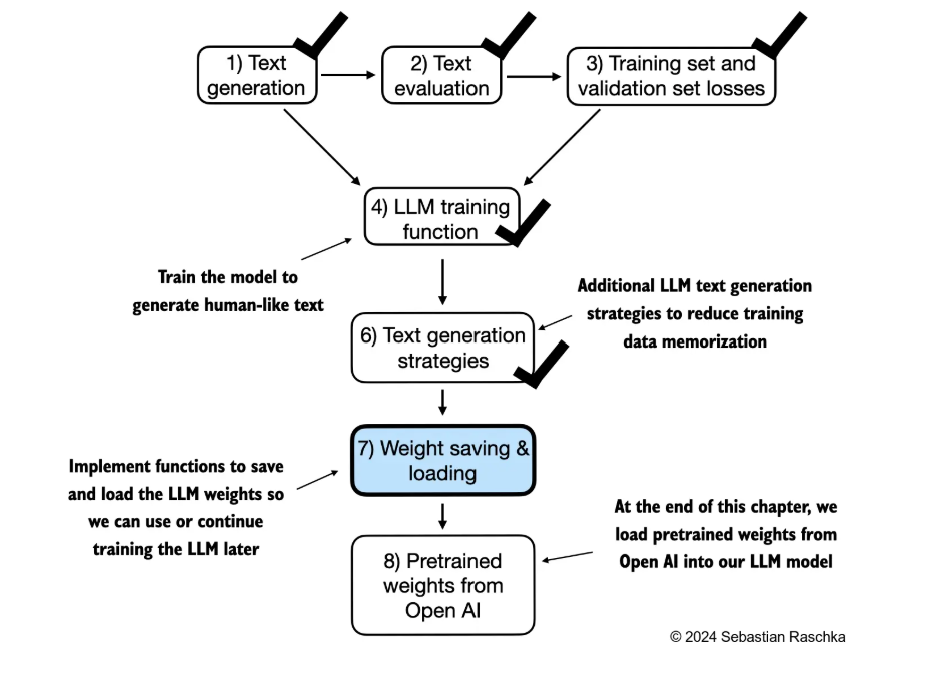
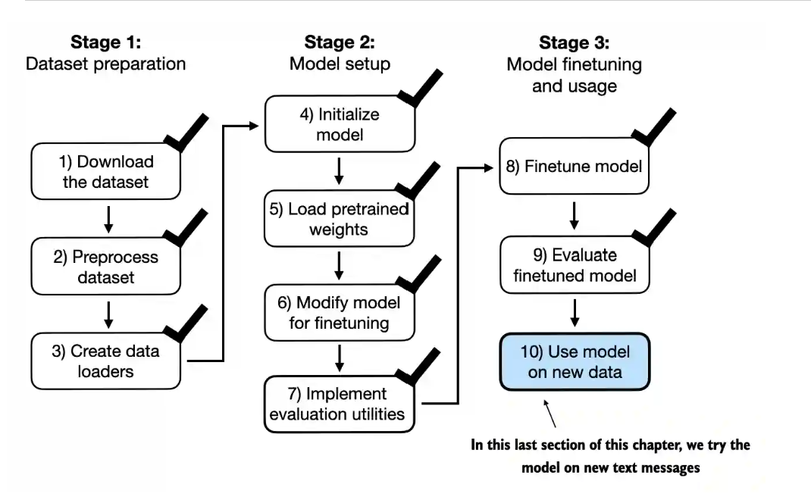
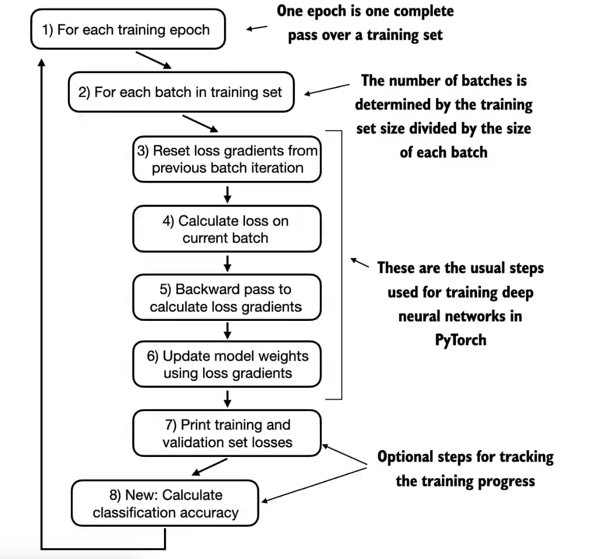

# ch02 Input Embedding

01.学习了 Input Embedding 的总体流程，从将 input 转化为 tokens，再转化为 tokeIDs，再进行词嵌入和位置信息 的嵌入，共同构成的输入信息的嵌入表示(主要代码，后面多数代码重复的)

02.比较了不同 BPE 实现策略的效率（未关注具体的实现策略）

03.比较了线性层和嵌入层的关系，二者的本质是一样的

04.直接对 token_ids 进行操作，加深对 dataloader 的理解

# ch03 自注意力与因果注意力

01.这个章节主要介绍了自注意力机制的实现，将 input embedding 转化为了 context 向量，即考虑了上下文；然后又介绍了利用 Query、Key、Value 三个矩阵实现一个可训练的自注意力层（下图）；然后考虑到隐藏未来的信息，又介绍了一个因果注意力，对未来部分进行一个掩码操作；最后讲了一个通过堆叠单头注意力层实现的多头注意力层，这里部分代码有点没看懂

# ch04 GPT model 的框架搭建

01.这一章节主要介绍了 GPT 的一个整体的框架，其中主要是由一系列的 Transform Block 构成，下面就是一个 Transform Block 的内容。然后到这里我才知道之前对于因果注意力机制理解可能有错，通过了因果注意力机制产生的向量是结合了这一位置和它之前位置的信息，产生的是是每一个位置对应的下一个位置的信息，从而每次只需要取处理后的最后一个 token 就可以作为下一个 token 的预测

# ch05 模型的预训练

01.这一章主要就是对模型进行预训练了，首先介绍了一下交叉熵和困惑度作为损失函数，然后主体的训练过程也是使用 pytorch'的一些库实现，这和之前刘二大人讲的 pytorch 使用里的内容差不多。然后又介绍了一下 temperature 和 top-k 让模型不只是生成一个固定的最大概率的值。最后介绍了一下如何把模型的训练权重参数进行保存。并加载了 GPT2 预训练的参数进行使用

# ch06 微调垃圾邮件分类器

01.这一节做的主要就是把预训练后的模型微调为一个区分垃圾邮件的模型。下面第一个图就是这一节的 pipline，实际上微调过程和之前预训练的过程类似，只是这里把最后一个线性层进行了一个修改，然后对原来架构的部分参数，采用标注的训练数据重新进行训练。具体的训练过程和之前预训练的过程基本一样，下面第二幅图就是一个微调训练的过程，通过梯度更新让交叉熵损失逐渐减少。最后在陌生数据上对微调后的模型性能进行了检测。

模型训练的过程

