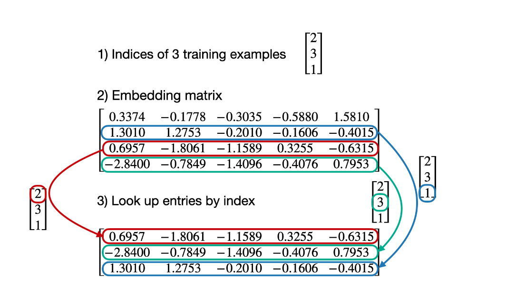
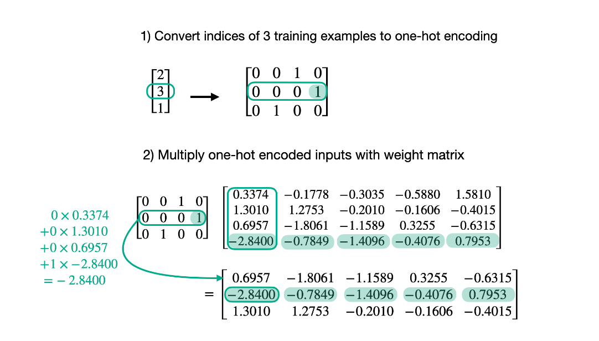

# ch02

## 01_main_chapter_code

### ch02

01.学习了 Input Embedding 的总体流程，从将 input 转化为 tokens，再转化为 tokeIDs，再进行词嵌入和位置信息      的嵌入，共同构成的输入信息的嵌入表示(主要代码，后面多数代码重复的)

02.比较了不同BPE实现策略的效率（未关注具体的实现策略）

03.比较了线性层和嵌入层的关系，二者的本质是一样的

04.直接对token_ids进行操作，加深对dataloader的理解
