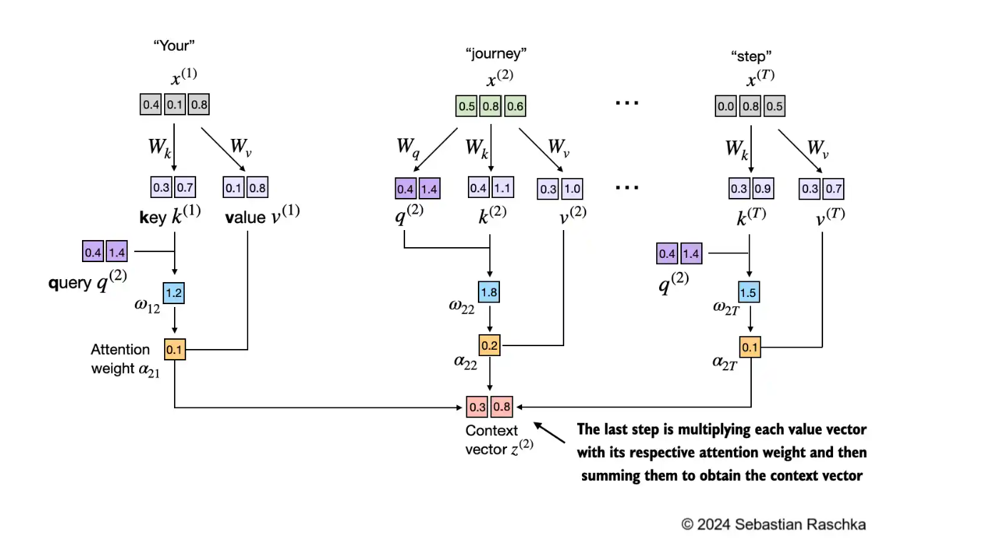
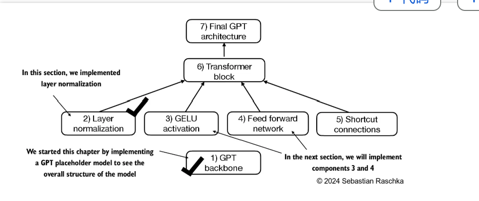
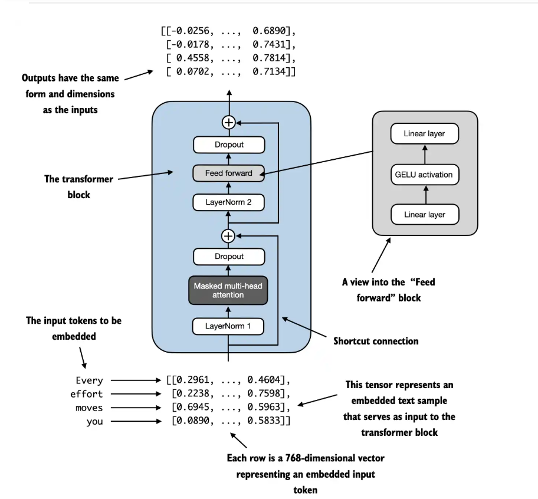
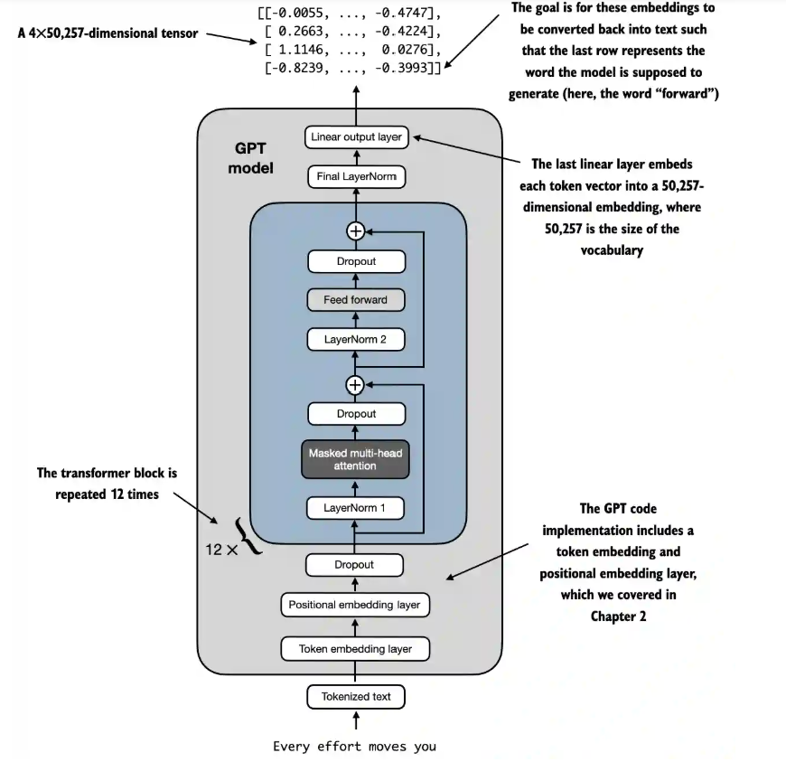

# ch02

01.学习了 Input Embedding 的总体流程，从将 input 转化为 tokens，再转化为 tokeIDs，再进行词嵌入和位置信息      的嵌入，共同构成的输入信息的嵌入表示(主要代码，后面多数代码重复的)

02.比较了不同BPE实现策略的效率（未关注具体的实现策略）

03.比较了线性层和嵌入层的关系，二者的本质是一样的

04.直接对token_ids进行操作，加深对dataloader的理解

# ch03

01.这个章节主要介绍了自注意力机制的实现，将input embedding转化为了context向量，即考虑了上下文；然后又介绍了利用Query、Key、Value三个矩阵实现一个可训练的自注意力层（下图）；然后考虑到隐藏未来的信息，又介绍了一个因果注意力，对未来部分进行一个掩码操作；最后讲了一个通过堆叠单头注意力层实现的多头注意力层，这里部分代码有点没看懂

# ch04

1. 这一章节主要介绍了GPT的一个整体的框架，其中主要是由一系列的Transform Block 构成，下面就是一个Transform Block的内容。然后到这里我才知道之前对于因果注意力机制理解可能有错，通过了因果注意力机制产生的向量是结合了这一位置和它之前位置的信息，产生的是是每一个位置对应的下一个位置的信息，从而每次只需要取处理后的最后一个token就可以作为下一个token的预测

# ch05

01.
